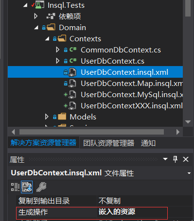
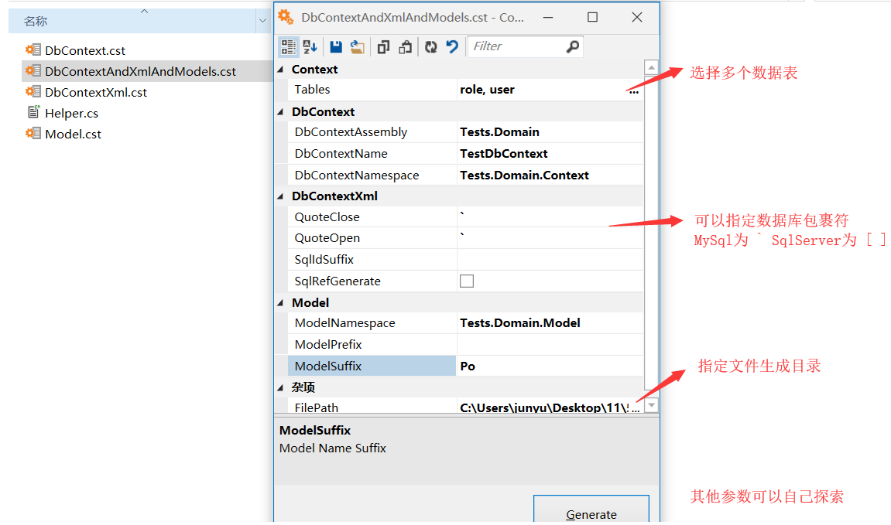

# Insql 说明文档

[](https://ci.appveyor.com/project/rainrcn/insql)

[](https://github.com/rainrcn/insql)
[](https://gitee.com/rainrcn/insql)

## 1. 介绍

**Insql 是一个轻量级的.NET ORM 类库。对象映射基于 Dapper, Sql 配置灵感来自于 Mybatis。**

🚀 追求简洁、优雅、性能与质量

QQ 交流群：737771272 欢迎加入

## 2. 安装

| Package                                                              | Nuget Stable                                                                                                                            | Downloads                                                                                                                                |
| -------------------------------------------------------------------- | --------------------------------------------------------------------------------------------------------------------------------------- | ---------------------------------------------------------------------------------------------------------------------------------------- |
| [Insql](https://www.nuget.org/packages/Insql/)                       | [](https://www.nuget.org/packages/Insql/)                                  | [](https://www.nuget.org/packages/Insql/)                                  |
| [Insql.MySql](https://www.nuget.org/packages/Insql.MySql/)           | [](https://www.nuget.org/packages/Insql.MySql/)                | [](https://www.nuget.org/packages/Insql.MySql/)                |
| [Insql.Oracle](https://www.nuget.org/packages/Insql.Oracle/)         | [](https://www.nuget.org/packages/Insql.Oracle/)             | [](https://www.nuget.org/packages/Insql.Oracle/)             |
| [Insql.PostgreSql](https://www.nuget.org/packages/Insql.PostgreSql/) | [](https://www.nuget.org/packages/Insql.PostgreSql/) | [](https://www.nuget.org/packages/Insql.PostgreSql/) |
| [Insql.Sqlite](https://www.nuget.org/packages/Insql.Sqlite/)         | [](https://www.nuget.org/packages/Insql.Sqlite/)             | [](https://www.nuget.org/packages/Insql.Sqlite/)             |

## 3. 特性

- **支持 DotNet Core 2.0+ & DotNet Framework 4.6.1+**
- **支持依赖注入系统**
- **类似 MyBatis sql xml 配置语法**
- **多数据库支持**
- **高性能**
- **灵活扩展性**
- **使用简单直观**

## 4. 使用

### 4.1 使用 Insql

```csharp
public void ConfigureServices(IServiceCollection services)
{
  services.AddInsql();  //会使用默认配置
}
```

### 4.2 设置 Insql

我们平常使用时，使用默认配置即可，可以无需设置下列选项。详细参数将在其他章节进行说明

```csharp
public void ConfigureServices(IServiceCollection services)
{
  services.AddInsql(builder =>
  {
      //添加嵌入程序集式的SQL XML配置文件
      builder.AddEmbeddedXml();

      //添加外部文件目录中的SQL XML配置文件，可指定目录地址
      builder.AddExternalXml();

      //添加SQL解析过滤器，可用于日志记录
      builder.AddResolveFilter();

      //添加SQL解析描述提供器，可扩展用于从多种来源加载SQL XML配置文件，例如从数据库中加载SQL XML配置。EmbeddedXml和ExternalXml就是其中的扩展
      builder.AddDescriptorProvider();

      //设置默认动态脚本解析器参数
      builder.AddDefaultScriptResolver();

      //设置默认多种数据库匹配器参数
      builder.AddDefaultResolveMatcher();
  });
}
```

### 4.3 示例代码

#### 4.3.1 只使用语句解析功能示例

`User.insql.xml`

```xml
<insql type="Insql.Tests.Domain.Services.UserService,Insql.Tests" >

<insert id="InsertUser">
  insert into user (user_name,user_gender)
  values (@UserName,@UserGender)
</insert>

<update id="UpdateUserSelective">
    update user_info
    <set>
      <if test="UserName != null">
        user_name=@UserName,
      </if>
      user_gender=@UserGender
    </set>
    where user_id = @UserId
  </update>
</insql>
```

**_注意：在默认设置情况下 User.insql.xml 文件需要右键属性选择`嵌入式程序集文件方式`才会生效_**

`UserService.cs`

```csharp
public class UserService : IUserService
{
  private readonly ISqlResolver<UserService> sqlResolver;

  //注入ISqlResolver<T>，insql.xml中的`type`需要与`T`对应
  public UserService(ISqlResolver<UserService> sqlResolver)
  {
      this.sqlResolver = sqlResolver;
  }

  public void UpdateUserSelective()
  {
      //解析SQL语句
      var resolveResult = this.sqlResolver.Resolve("UpdateUserSelective", new UserInfo
      {
        UserId="10000",
        UserName="tom",
        UserGender = UserGender.W
      });

      //执行语句
      //connection.Execute(resolveResult.Sql,resolveResult.Param) ...
  }
}
```

这样就可以实现语句解析与执行了。就这么简单。

#### 4.3.2 基本用法示例

`UserDbContext.insql.xml`

```xml
<insql type="Insql.Tests.Domain.Contexts.UserDbContext,Insql.Tests" >

  <!--定义UserInfo类型数据库字段到对象属性映射-->
  <map type="Insql.Tests.Domain.Models.UserInfo,Insql.Tests">
    <key name="user_id" to="UserId" />
    <column name="user_name" to="UserName" />
    <column name="user_gender" to="UserGender" />
  </map>

  <select id="GetUser">
    select * from user_info where user_id = @userId
  </select>

</insql>
```

**_注意：在默认设置情况下 UserDbContext.insql.xml 文件需要右键属性选择`嵌入式程序集文件方式`才会生效_**

`UserDbContext.cs`

```csharp
//insql.xml中的`type`需要与`UserDbContext`类型对应
public class UserDbContext : DbContext
{
    public UserDbContext(DbContextOptions<UserDbContext> options) : base(options)
    {
    }

    public UserInfo GetUser(int userId)
    {
        //sqlId参数是"GetUser"与insql.xml中的sql id对应
        //sqlParam参数支持PlainObject和IDictionary<string,object>类型
        return this.Query<UserInfo>(nameof(GetUser), new { userId }).SingleOrDefault();
    }
}
```

`UserService.cs` 使用 UserDbContext

```csharp
public class UserService : IUserService
{
    private readonly UserDbContext dbContext;

    public UserService(UserDbContext dbContext)
    {
        this.dbContext = dbContext;
    }

    public UserInfo GetUser(int userId)
    {
        return this.dbContext.GetUser(userId);
    }
}
```

`Startup.cs` 注册 UserDbContext 和 UserService

```csharp
public void ConfigureServices(IServiceCollection services)
{
    //注册Insql
    services.AddInsql();

    //注册UserDbContext
    services.AddInsqlDbContext<UserDbContext>(options =>
    {
      //选择UserDbContext数据库连接
      //options.UseSqlServer(this.Configuration.GetConnectionString("sqlserver"));
      options.UseSqlite(this.Configuration.GetConnectionString("sqlite"));
    });

    services.AddScoped<IUserService,UserService>();
}
```

这就是完整的使用流程，例子是使用领域驱动模型方式，自己使用时可以看情况而定。例如可以在 Controller 中注入 UserDbContext 使用，而不需要 UserService。

## 5. 配置语法

**xxx.insql.xml** 中的配置语法类似于 Mybatis 的配置语法，目前支持以下配置节：

- **map**
  - **key**
  - **column**
- **sql**
  - **include**
  - **bind**
  - **if**
  - **where**
  - **set**
  - **trim**
  - **each**
- **select** = **sql**
- **insert** = **sql**
- **update** = **sql**
- **delete** = **sql**

### 5.1 map

`map`配置节用于数据库表字段到对象属性的映射，这样只要通过`DbContext.Query<UserInfo>`查询的都将使用此映射

```xml
<map type="Insql.Tests.Domain.Models.UserInfo,Insql.Tests">
  <key name="user_id" to="UserId" />
  <column name="user_name" to="UserName" />
  <column name="user_gender" to="UserGender" />
</map>
```

| 子元素名 | 属性名  | 属性说明   | 说明       |
| -------- | ------- | ---------- | ---------- |
| `key`    |         |            | 表示主键列 |
|          | `name*` | 表列名     |            |
|          | `to*`   | 对象属性名 |            |
| `column` |         |            | 表示普通列 |
|          | `name*` | 表列名     |            |
|          | `to*`   | 对象属性名 |            |

### 5.2 sql

`sql`配置节用于配置数据库执行语句。`select`,`insert`,`update`,`delete`与`sql`具有相同功能，只是`sql`配置节的别名。

```xml
<sql id="userColumns">
  user_id as UserId,user_name as UserName,user_gender as UserGender
</sql>

<select id="GetUser">
  select
  <include refid="userColumns" />
  from user_info
  where user_id = @userId
</select>
```

| 子元素名  | 属性名            | 属性说明                                                                | 说明                                                                                                                                |
| --------- | ----------------- | ----------------------------------------------------------------------- | ----------------------------------------------------------------------------------------------------------------------------------- |
| `include` |                   |                                                                         | 导入其他`sql`配置节                                                                                                                 |
|           | `refid*`          | 要导入的配置节 `id`                                                     |                                                                                                                                     |
| `bind`    |                   |                                                                         | 创建新查询参数到当前参数列表，例如 like 模糊查询场景                                                                                |
|           | `name*`           | 创建的新参数名称                                                        |                                                                                                                                     |
|           | `value*`          | 动态脚本表达式，例如: '%'+userName+'%'                                  |                                                                                                                                     |
|           | `valueType`       | 指定`value`返回的类型，格式为 System.TypeCode 枚举,数值类型最好明确指定 |                                                                                                                                     |
| `if`      |                   |                                                                         | 判断动态表达式，满足则输出内部内容                                                                                                  |
|           | `test*`           | 动态表达式，需要返回 bool 类型，例如: userName != null                  |                                                                                                                                     |
| `where`   |                   |                                                                         | 在当前位置添加`where` sql 段，具体是否输出`where`决定于其内部子元素是否有有效的内容输出，并且会覆盖开头的 `and`,`or`                |
| `set`     |                   |                                                                         | 在当前位置添加`set` sql 段，主要用于`update`配置节中，具体是否输出`set`决定于其内部子元素是否有有效的内容输出，并且会覆盖结尾的 `,` |
| `trim`    |                   |                                                                         | 修剪包裹的元素输出，可以指定的前缀字符和后缀字符来包裹子元素                                                                        |
|           | `prefix`          | 包裹的前缀字符                                                          |                                                                                                                                     |
|           | `suffix`          | 包裹的后缀字符                                                          |                                                                                                                                     |
|           | `prefixOverrides` | 会覆盖内部输出开头指定字符                                              |                                                                                                                                     |
|           | `suffixOverrides` | 会覆盖内部输出结尾指定字符                                              |                                                                                                                                     |
| `each`    |                   |                                                                         | 循环数组类型的查询参数每个值                                                                                                        |
|           | `name*`           | 循环的数组参数名称                                                      |                                                                                                                                     |
|           | `separator`       | 每个值之间的分隔符                                                      |                                                                                                                                     |
|           | `open`            | 包裹的左侧字符                                                          |                                                                                                                                     |
|           | `close`           | 包裹的右侧字符                                                          |                                                                                                                                     |
|           | `prefix`          | 每个值名称前缀                                                          |                                                                                                                                     |
|           | `suffix`          | 每个值名称后缀                                                          |                                                                                                                                     |

`include`,`where`,`if`,`bind`

```xml
<select id="GetUserList">
    <include refid="selectUserColumns" />
    <where>
        <if test="userName != null">
          <bind name="likeUserName" value="'%' + userName + '%'" />
          user_name like @likeUserName
        </if>
        and user_gender = @userGender
    </where>
    order by  user_id
  </select>
```

`set`

```xml
<update id="UpdateUserSelective">
  update user_info
  <set>
    <if test="UserName != null">
      user_name=@UserName,
    </if>
    user_gender=@UserGender
  </set>
  where user_id = @UserId
</update>
```

`trim`

```xml
<insert id="InsertUserSelective">
    insert into user
    <trim prefix="(" suffix=")" suffixOverrides=",">
      user_id,
      <if test="UserName != null">
        user_name,
      </if>
      <if test="UserGender != null">
        user_gender,
      </if>
      create_time,
      <if test="LastLoginTime != null">
        last_login_time,
      </if>
    </trim>
    <trim prefix="values (" suffix=")" suffixOverrides=",">
      @UserId,
      <if test="UserName != null">
        @UserName,
      </if>
      <if test="UserGender != null">
        @UserGender,
      </if>
      @CreateTime,
      <if test="LastLoginTime != null">
        @LastLoginTime,
      </if>
    </trim>
  </insert>
```

`each`

```xml
<select id="EachIn">
  select * from user_info
  where user_id in
  <each name="userIdList" open="(" separator="," close=")" prefix="@"  />
</select>
```

SqlResolver 解析之后:

```sql
select * from user_info where user_id in (@userIdList1,@userIdList2)
```

**_注意：解析之后会删除原先的`userIdList`参数，并增加`userIdList1`,`userIdList2`参数_**

_小提示：在 select in list 上也可以使用 Dapper 自带的参数列表转换功能_

## 6. 动态脚本

动态脚本语法为 JAVASCRIPT。支持 ECMAScript 6 的常用对象属性。

```xml
<if test="userGender !=null and userGender == 'W' ">
  and user_gender = @userGender
</if>
```

`userGender !=null and userGender == 'W'`部分为动态脚本。

### 6.1 操作符转换

因为`&`,`<`这些在 XML 中有特殊意义，所以支持将在动态脚本中这些符号转换。目前支持下列符号转换：

| 转换前 | 转换后 |
| ------ | ------ |
| `and`  | `&&`   |
| `or`   | `\|\|` |
| `gt`   | `>`    |
| `gte`  | `>=`   |
| `lt`   | `<`    |
| `lte`  | `<=`   |
| `eq`   | `==`   |
| `neq`  | `!=`   |

_操作符转换功能可以被禁用，也可以排除其中部分操作符的转换_

**_注意：请避免与上述操作符名称相同的查询参数，如果无法避免，可以设置排除有冲突的操作符。之后用 xml 转移符号实现操作符_**

### 6.2 枚举转换为字符串

`userGender == 'W'` `userGender`属性为枚举类型，在动态脚本中会默认转换为字符换格式。可以禁用此转换功能，禁用后枚举会被转换为`number`类型。

### 6.3 时间类型转换

如果查询参数中包含时间类型`DateTime`将被转 JS 中的`Date`类型，因为 Date 最小时间为 1970.1.1，所以如果查询对象中有未赋值的 DateTime(0001.1.1)，或者小于 1970 这个时间的 DateTime，将被默认转换为 1970.1.1，转换只是发生在动态脚本运行时，并不会影响查询参数的原始值。如果参数对象中有未赋值的`DateTime?`类型，那么它本身会是 null，并不会被转换。

### 6.4 设置动态脚本

```csharp
public void ConfigureServices(IServiceCollection services)
{
    services.AddInsql(builder =>
    {
        builder.AddDefaultScriptResolver(options =>
        {
            options.IsConvertOperator = false;  //禁用操作符转换
            options.IsConvertEnum = false; //禁用枚举转换为字符串
            options.ExcludeOperators = new string[]
            {
                "eq","neq"  //排除eq,neq操作符转换
            };
        });
    });
}
```

## 7. 多数据库匹配

```xml
<!--默认，例子用Sqlite数据库-->
<insert id="InsertUser">
  insert into user_info (user_name,user_gender) values (@UserName,@UserGender);
  select last_insert_rowid() from user_info;
</insert>
<!--MySql-->
<insert id="InsertUser.MySql">
  insert into user_info (user_name,user_gender) values (@UserName,@UserGender);
  select LAST_INSERT_ID();
</insert>
<!--SqlServer-->
<insert id="InsertUser.SqlServer">
  insert into user_info (user_name,user_gender) values (@UserName,@UserGender);
  select SCOPE_IDENTITY();
</insert>
```

### 7.1 设置多数据库匹配

```csharp
public void ConfigureServices(IServiceCollection services)
{
  services.AddInsql(builder=>
  {
      builder.AddDefaultResolveMatcher(options=>
      {
          options.CorssDbEnabled = false; //是否启用多数据库匹配功能，默认启用
          options.CorssDbSeparator = "@"; //多数据库匹配分隔符，默认为 `.`
      });
  });
}
```

_匹配分隔符将变为如下：_

```xml
<insert id="InsertUser">
  insert into user_info (user_name,user_gender) values (@UserName,@UserGender);
  select LAST_INSERT_ID();
</insert>
<!--SqlServer-->
<insert id="InsertUser@SqlServer">
  insert into user_info (user_name,user_gender) values (@UserName,@UserGender);
  select SCOPE_IDENTITY();
</insert>
```

### 7.2 匹配规则

```csharp
public void ConfigureServices(IServiceCollection services)
{
    services.AddInsqlDbContext<UserDbContext>(options =>
    {
      //匹配哪个SqlId，决定于使用何种数据库
      options.UseSqlServer(this.Configuration.GetConnectionString("sqlserver"));
      //options.UseSqlite(this.Configuration.GetConnectionString("sqlite"));
    });

    services.AddScoped<IUserService,UserService>();
}
```

**_如果当前使用的是 SqlServer，则会优先匹配后缀带`.SqlServer`的语句。如果未找到则匹配默认不带后缀的语句。_**

**_目前支持匹配的数据库后缀：`SqlServer` `Sqlite` `MySql` `Oracle` `PostgreSql`_**

## 8. 多配置来源

### 8.1 嵌入程序集文件方式来源



**设置来源参数：**

```csharp
public void ConfigureServices(IServiceCollection services)
{
    services.AddInsql(builder =>
    {
        builder.AddEmbeddedXml(options =>
        {
            options.Enabled = false;    //可以禁用此来源功能，默认为启用状态
            //options.Matches = "**/*.insql.xml"; //glob文件过滤表达式，此为默认值
            //...
        });
    });
}
```

### 8.2 外部文件目录方式来源

```csharp
public void ConfigureServices(IServiceCollection services)
{
    services.AddInsql(builder =>
    {
        builder.AddExternalXml(options=>
        {
            options.Enabled = true; //可以启动此来源，默认为禁用状态
            options.Directory = "D:\\Insqls";   //配置加载目录，支持递归搜索，子文件夹也会扫描，默认为当前程序执行目录
            //options.Matches = "**/*.insql.xml"; //glob文件筛选表达式，此为默认值
        });
    });
}
```

### 8.3 多配置来源合并功能

`EmbeddedXml`和`ExternalXml`方式可以同时启用，对于 insql type 相同的文件，后者会覆盖前者 sqlId 相同的语句配置，以及 map type 相同的映射配置。

## 9. 扩展功能

### 9.1 语句解析过滤器

创建一个语句解析后的日志记录过滤器

```csharp
public class LogResolveFilter : ISqlResolveFilter
{
  private readonly ILogger<LogResolveFilter> logger;

  public LogResolveFilter(ILogger<LogResolveFilter> logger)
  {
      this.logger = logger;
  }

  public void OnResolved(ResolveContext resolveContext, ResolveResult resolveResult)
  {
      this.logger.LogInformation($"insql resolved id : {resolveContext.InsqlSection.Id} , sql : {resolveResult.Sql}");
  }

  public void OnResolving(InsqlDescriptor insqlDescriptor, string dbType, string sqlId, IDictionary<string, object> sqlParam)
  {
  }
}
```

`OnResolving`为解析前执行，`OnResolved`为解析后执行

**启用过滤器：**

```csharp
public void ConfigureServices(IServiceCollection services)
{
  services.AddInsql(builder =>
  {
      builder.AddResolveFilter<LogResolveFilter>();
  });
}
```

### 9.2 语句配置描述提供器

```csharp
public interface IInsqlDescriptorProvider
{
    IEnumerable<InsqlDescriptor> GetDescriptors();
}
```

实现上面的接口即可实现，具体实现细节可以参考`EmbeddedXml`或`ExternalXml`部分的源码。详细实现细节以后会写文档说明。

## 10. 工具

### 10.1 代码生成器

在源码的`tools`目录下包含 CodeSmith 的生成器文件，安装 CodeSmith 后直接运行这些文件就可。



**生成代码示例：只展示一张数据表**

`UserPo.cs`

```csharp
namespace Tests.Domain.Model
{
	public class UserPo
	{
    /// <summary>
    /// user_id
    /// </summary>
    public int UserId { get; set; }

    /// <summary>
    /// user_name
    /// </summary>
    public string UserName { get; set; }

    /// <summary>
    /// user_gender
    /// </summary>
    public string UserGender { get; set; }

    /// <summary>
    /// user_intro
    /// </summary>
    public string UserIntro { get; set; }

    /// <summary>
    /// create_time
    /// </summary>
    public DateTime CreateTime { get; set; }

    /// <summary>
    /// last_login_time
    /// </summary>
    public DateTime? LastLoginTime { get; set; }
	}
}
```

`TestDbContext.cs`

```csharp
namespace Tests.Domain.Context
{
  public class UserDbContext : DbContext
  {
    public UserDbContext(DbContextOptions<UserDbContext> options) : base(options)
    {
    }

    /*
        UserPo
    */
    public int SelectUserCountByKey(int UserId)
    {
        return this.Query<UserPo>(nameof(SelectUserCountByKey),new
        {
          UserId
        }).Count();
    }

    public UserPo SelectUserByKey(int UserId)
    {
        return this.Query<UserPo>(nameof(SelectUserByKey),new
        {
          UserId
        }).SingleOrDefault();
    }

    public void InsertUser(UserPo info)
    {
        this.Execute(nameof(InsertUser),info);
    }

    public void InsertUserSelective(UserPo info)
    {
        this.Execute(nameof(InsertUserSelective),info);
    }

    public void UpdateUserByKey(UserPo info)
    {
        this.Execute(nameof(UpdateUserByKey),info);
    }

    public void UpdateUserSelectiveByKey(UserPo info)
    {
        this.Execute(nameof(UpdateUserSelectiveByKey),info);
    }
    public void DeleteUserByKey(int UserId)
    {
        this.Execute(nameof(DeleteUserByKey),new
        {
          UserId
        });
    }
  }
}
```

`TestDbContext.insql.xml`

```xml
<insql type="Tests.Domain.Context.UserDbContext,Tests.Domain">
  <!--
    user
  -->
  <map type="Tests.Domain.Model.UserPo,Tests.Domain">
   <key name="user_id" to="UserId" />
   <column name="user_name" to="UserName" />
   <column name="user_gender" to="UserGender" />
   <column name="user_intro" to="UserIntro" />
   <column name="create_time" to="CreateTime" />
   <column name="last_login_time" to="LastLoginTime" />
  </map>

  <select id="SelectUserCountByKey">
    select count(*) from `user` where `user_id` = @UserId
  </select>

  <select id="SelectUserByKey">
    select * from `user` where `user_id` = @UserId
  </select>

  <insert id="InsertUser">
    insert into `user` (`user_id`,`user_name`,`user_gender`,`user_intro`,`create_time`,`last_login_time`) values (@UserId,@UserName,@UserGender,@UserIntro,@CreateTime,@LastLoginTime)
  </insert>

  <insert id="InsertUserSelective">
    insert into `user`
    <trim prefix="(" suffix=")" suffixOverrides=",">
      `user_id`,
      `user_name`,
      `user_gender`,
      <if test="UserIntro != null">
        `user_intro`,
      </if>
      `create_time`,
      <if test="LastLoginTime != null">
        `last_login_time`,
      </if>
    </trim>
    <trim prefix="values (" suffix=")" suffixOverrides=",">
      @UserId,
      <if test="UserName != null">
        @UserName,
      </if>
      <if test="UserGender != null">
        @UserGender,
      </if>
      <if test="UserIntro != null">
        @UserIntro,
      </if>
      @CreateTime,
      <if test="LastLoginTime != null">
        @LastLoginTime,
      </if>
    </trim>
  </insert>

  <update id="UpdateUserByKey">
    update `user`
    <set>
     `user_name` = @UserName,
     `user_gender` = @UserGender,
     `user_intro` = @UserIntro,
     `create_time` = @CreateTime,
     `last_login_time` = @LastLoginTime,
    </set>
    where `user_id` = @UserId
  </update>

  <update id="UpdateUserSelectiveByKey">
    update `user`
    <set>
      <if test="UserName != null">
        `user_name` = @UserName,
      </if>
      <if test="UserGender != null">
        `user_gender` = @UserGender,
      </if>
      <if test="UserIntro != null">
        `user_intro` = @UserIntro,
      </if>
      `create_time` = @CreateTime,
      <if test="LastLoginTime != null">
        `last_login_time` = @LastLoginTime,
      </if>
    </set>
    where `user_id` = @UserId
  </update>
  <delete id="DeleteUserByKey">
    delete from `user` where `user_id` = @UserId
  </delete>
</insql>
```

## 11. 体会

### 11.1 自己这些年在数据访问上的感受

在数据访问工具上其实自己一直想要一个性能强，操作能直达数据库，没有中间缓存，使用简洁并且使用方式一致（例如某些类库即需要写 Linq 又需要写 Sql，混乱而且坑多，用起来会很心累），灵活并且能充分利用各种数据库的特性，对于一个 ORM 来说想要满足这些其实很不容易。我走过了从写 SQL 用 Linq 的这些路，而我现在又回到了开始，但是这一次回来体会却不同，因为工具变成了我想要的 Insql，也许 TA 还有很多不足，但我会尽力完美 TA。其实写 SQL 没有那么可怕，恰恰这是访问数据库最亲近的表达。

## 12. 更新

- 1.8.2

  - 重新编写并美化说明文档
  - 优化动态脚本执行引擎，减少资源分配，提高运行性能
  - 优化代码生成器，解决某些生成代码的 BUG

- 1.5.0
  - 支持 map 配置块，用于映射数据库表字段到类属性字段。使查询对象时映射更加简单，无需 as 别名。
  - 支持 SQL 配置文件目录来源，可以从指定的文件目录加载 SQL 配置，并支持与嵌入式 SQL 配置合并
  - 优化动态脚本解析对 DateTime.Min 的转换功能

## 13. 计划

- 支持 #{} 语法的参数占位符，并向后兼容现有的参数语法
- 支持 mybatis foreach 代码块
- 是否需要兼容 mybatis 的 resultMap 配置块?
